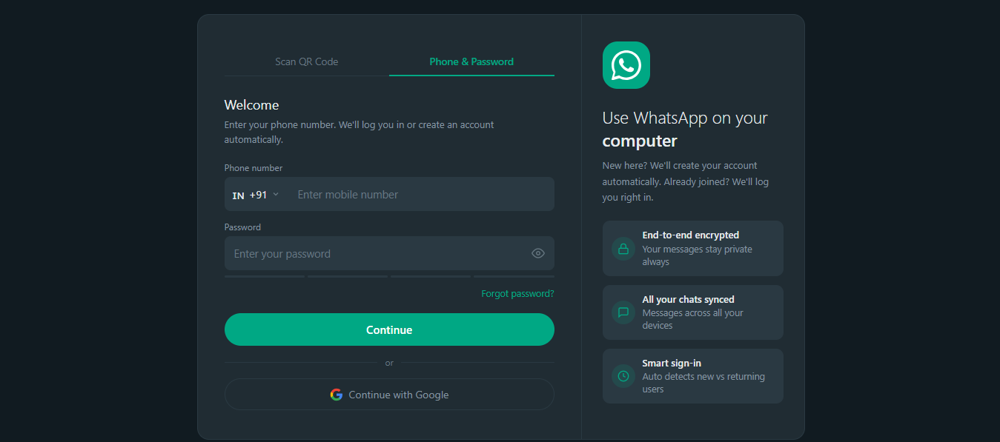
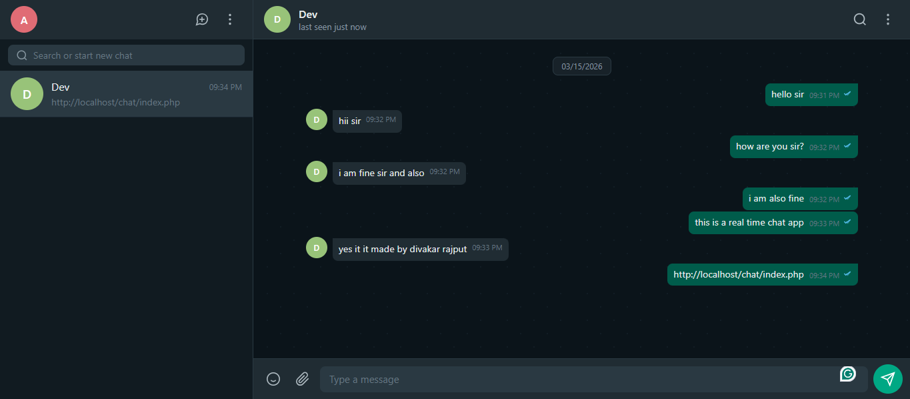
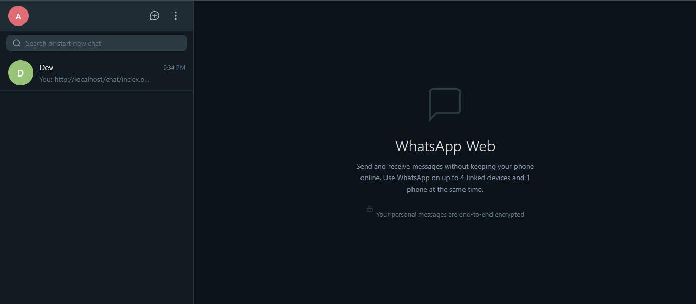

# chatApp

# 💬 ChatApp — Real-Time Chat Web App

A modern, WhatsApp-inspired real-time chat web application built with PHP, featuring instant messaging, user authentication, and a sleek dark-themed UI.

---

## 📸 Screenshots

### 🔐 Login Page

> Phone & Password login with Google Sign-In support and smart sign-in detection.

### 💬 Chat Interface

> WhatsApp-style real-time messaging with timestamps, read receipts, and a dark theme.

### 🏠 Home Screen

> Contact list with last message preview and WhatsApp Web-style landing screen.

---

## ✨ Features

- ⚡ **Real-Time Messaging** — Instant message delivery without page refresh
- 🔐 **User Authentication** — Login with Phone & Password or Google Account
- 🌙 **Dark Theme UI** — WhatsApp-inspired dark interface
- ✅ **Read Receipts** — Double tick indicators for sent messages
- 🕐 **Message Timestamps** — Precise time displayed on every message
- 📋 **Chat List Sidebar** — See all conversations with last message preview
- 📱 **Responsive Design** — Works across devices and screen sizes

---

## 🛠️ Tech Stack

| Layer | Technology |
|---|---|
| **Backend** | PHP |
| **Frontend** | HTML, CSS, JavaScript |
| **Database** | MySQL |
| **Real-Time** | AJAX / WebSockets / Long Polling |
| **Auth** | Session-based |
| **Server** | Apache / XAMPP (localhost) |

---

## 🚀 Getting Started

### Prerequisites

- PHP >= 7.4
- MySQL >= 5.7
- Apache Server (XAMPP / WAMP / LAMP)
- A modern web browser

### Installation

1. **Clone the repository**
   ```bash
   git clone https://github.com/your-username/chatApp.git
   cd chatApp
   ```

2. **Move to your server's web directory**
   ```bash
   # For XAMPP (Windows)
   cp -r realchat/ C:/xampp/htdocs/chat/

   # For XAMPP (Linux/Mac)
   cp -r realchat/ /opt/lampp/htdocs/chat/
   ```

3. **Set up the database**
   - Open `phpMyAdmin` at `http://localhost/phpmyadmin`
   - Create a new database named `chatApp`
   - Import the provided SQL file:
     ```
     database/chatapp.sql
     ```

4. **Configure the database connection**

   Edit `config/db.php`:
   ```php
   <?php
   define('DB_HOST', 'localhost');
   define('DB_USER', 'root');
   define('DB_PASS', '');
   define('DB_NAME', 'chatapp');
   ?>
   ```

5. **Start the server and open the app**
   ```
   http://localhost/chat/index.php
   ```

---

## 📁 Project Structure

```
chat/
├── index.php               # Home Page
├── api.php
├── login.php
├── logout.php           
├── check_user.php        
```

---

## 🔧 How It Works

1. **User logs in** via Phone & Password or Google OAuth.
2. **Chat list loads** showing all available contacts and last messages.
3. **User selects a contact** — conversation history loads instantly.
4. **Messages are sent** via AJAX to the PHP backend, stored in MySQL.
5. **Polling / WebSocket** continuously fetches new messages and updates the UI in real time.
6. **Read receipts** update as soon as the recipient opens the conversation.

---

## 🙌 Author

**Divakar Rajput**

> *"This is a real time chat app"* — as seen live in the app itself! 😄

- GitHub: [@divakarrajput](https://github.com/Divakar-Rajput)


---

## 🤝 Contributing

Contributions, issues, and feature requests are welcome!

1. Fork the project
2. Create your feature branch (`git checkout -b feature/AmazingFeature`)
3. Commit your changes (`git commit -m 'Add some AmazingFeature'`)
4. Push to the branch (`git push origin feature/AmazingFeature`)
5. Open a Pull Request

---

## ⭐ Show Your Support

If you found this project helpful, please give it a ⭐ on GitHub — it means a lot!
